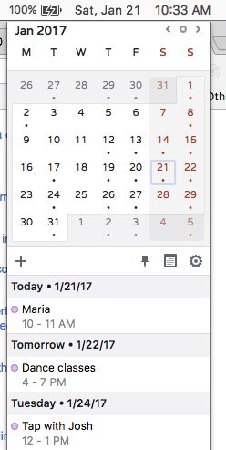

This is a fork of solomon23's fork of [sfsam/itsycal](https://github.com/sfsam/Itsycal), a very cool open source
status bar calendar.

Solomon23's fork alters the look of the calendar.

This fork slightly modifies the new look.

It also adds a hidden option to mimic the system clock's appearance instead of showing a date icon, a feature that becomes obsolete with sfsam's improved version 0.11.1. 

For more info, see: [http://www.mowglii.com/itsycal](http://www.mowglii.com/itsycal)
